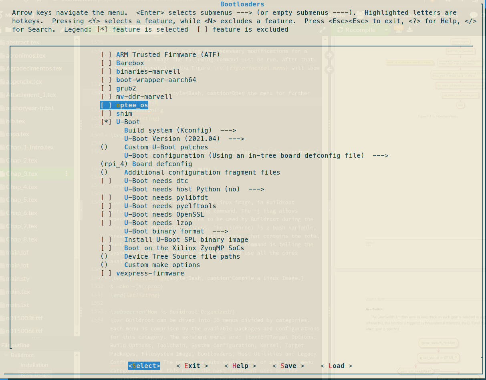

# Neneco

    > Version: Neneco - 1 Tomoe Sharingan (0.1)

Neneco project is an unofficial port of FreeRTOS for Raspberry Pi 4 Model B.
Neneco provide an abstraction layer in order to make the development of programs on RPI4B with FreeRTOS as easy as possible. This project began when the main developer needed to create a program with real time requirements and as constrains the RPI4B board.

## Why Sharingan names?

As said before, Neneco emerge from the need to develop a real time application. This project it is called Susanoo (Tribute to Susanoo from Naruto and not the Japanese God). Susanoo project is a mixed criticality application on automotive sector. The goal of Susanoo is reducing the number of ECU's inside a vehicle. To achieve that, strong virtualization techniques are being used, like a hypervisor to provide spacial and temporal isolation between the critical and non-critical subsystems. Thus, Neneco is the critical subsystem of Susanoo. The main goal is developing Neneco until Mangekyō Sharingan, the only sharingan able to invoke Susanoo.
    
## Available Drivers

On currently version the supported drivers are:

-  [X] GPIO
-  [X] GCI-400 (Interrupt controller) 
-  [ ] UART

    The driver only implements UART2. In further versions will be added suport to all UART's.
-  [ ] I2C

    The driver only implements I²C device 1. In further versions will be added suport to all I²C devices.
-  [ ] SPI

    The driver only implements SPI device 0. In further versions will be added suport to all SPI devices.
-  [ ] PWM

    The driver only implements PWM device 0 channel 1. In further versions will be added suport to all PWM's and channels.
-  [ ] GPIO Clock Manager

    The driver only implements PWM clock. In further versions will be added suport to all clocks.
    
### Extra
Neneco implements some drivers for board comonly used in projects. For now, neneco give support to:
-  [X] ADS1115 

    A four ADC channel to I²C.
-  [X] L298N 

    A dual H-Bridge motor driver which allows speed and direction control of two DC motors at the same time.

## Organization
Neneco is divided into two folders: FreeRTOS_port and RPI4_drivers.

The FreeRTOS_port contains all the necessary files for the raw FreeRTOS port. Thank you [eggman](https://github.com/eggman/FreeRTOS-raspi3) and [TImada](https://github.com/TImada/raspi4_freertos)for the amazing job!

The RPI_drivers contains the drivers to give support to RPI4B, contains the main application as well, but the location of main application can be changed.

### Main application

The available main file, always provide a complete test over the implemented drivers. Thus, the version  **1 Tomoe Sharingan** provide a complete test over the drivers specified above.
To test a specific driver, the only thing to do is uncomment the driver function on main function. But this is covered later.

## Pre-requisites

To be able to compile and use Neneco project, some tools are needed. The approach explained here is not unique! But it is, probably, the easier one.

### Building a Default Image.

So, this project need U-Boot to run. In order to obtain this and the image for the RPI4B [Buildroot](https://buildroot.org/) will be used.

1. Install Buildroot

    ```zsh
    git clone https://github.com/buildroot/buildroot.git
    ```

2. Default configuration list

    ```zsh
    make list-defconfigs
    ```

3. Select a default configuration for RPI4B 64 bit

    ```zsh
    make raspberrypi4_64_defconfig
    ```

4. Open the menu for further modifications

    ```zsh
    make menuconfig
    ```

5. Select U-Boot as bootloader (Bootloaders -> U-Boot). In Board defconfig write: rpi_4

    


1. Copiar a imagem para o cartão sd através do comando dd com a imagem sdcard.img
2. copiar o ficheiro config.txt para a partição boot
3. copiar o ficheiro kernel8.img para a partição boot
4. copiar o ficheiro elf com a app freeRTOS para a partição boot
5. Para correr na rpi:

dcache off

fatload mmc 0 0x28000000 uart.elf

dcache flush

bootelf 0x28000000
