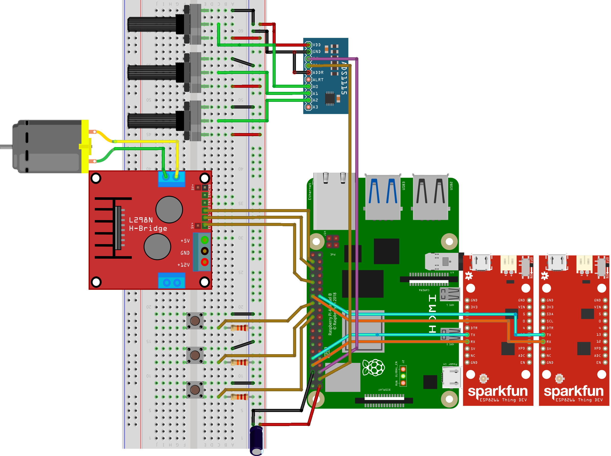
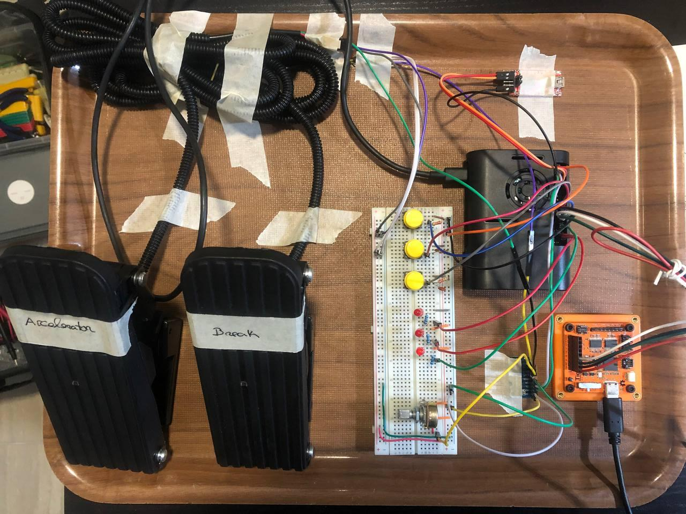

# Neneco Demo

    > This demo use version: Neneco - 1 Tomoe Sharingan (v0.1)


## About the Demo

This demo implements the version beta of Susanoo critical subsystem. The purpose is to test, in an integrated environment, the accelerator, brake, steering wheel, engine control and gear switch ECU's emulation.

To achive that the accelerator, brake and gear switch must interact with the engine control ECU. Once there is no actuator for the steering wheel the read value is printed on UART2.

## Drivers used in this demo

-  [X] GPIO
-  [X] GCI-400 (Interrupt controller) 
-  [X] UART
-  [X] I2C
-  [X] PWM
-  [X] GPIO Clock Manager
-  [X] ADS1115 
-  [X] L298N 

## 

## Pre-requisites

To be able to compile and use this demo first you need to follow the generic Neneco [Pre-requisites](https://github.com/D3boker1/Neneco-FreeRTOS-On-RPI4B/tree/main).

## Building and running the Demo

### Hardware

#### Tools
To build this demo you need:

* Raspberry Pi 4 Model B
* ADS1115
* FTDI (one or two)

    If you use the same FTDI for start and run the demo please be careful to not demage your RPIB. I recomend two FTDI, in order to not change the connections on RPI during execution.
* 3 LED (or the LN298 motor driver itself)
* 3 potentiometers (accelerator, brake and steering wheel)

Use capacitors in the voltage supplie.

#### Connections

See the connections in the Figure bellow.



Photo of the real hardware connection for testing.



### Software

1. Clone the demo branch

    ```zsh
    git clone --branch demo https://github.com/D3boker1/Neneco-FreeRTOS-On-RPI4B.git
    ```

2. Go to neneco folder

    ```zsh
    cd <your-path-here>/FreeRTOS_over_rpi/RPI4_drivers/neneco
    ```

3.   Compile the Demo. 

    ```zsh
    make
    ```
    
4. Copy the neneco.elf file to the boot partition of your SD card.

5. Put the card on RPI4B and power up!

Now, wait until U-Boot start printing the boot process. When it appears, click in some key quickly. The U-Boot prompt should appear.

Write the following commands to start running Neneco.

```zsh
dcache off
fatload mmc 0 0x28000000 neneco.elf
dcache flush
bootelf 0x28000000
```

6. You can now use the demo.

## Support

Use the Github Issues to report any type of issues or problems! Feel free to help me improving Neneco!

Francisco Marques,

University of Minho

<fmarques_00@protonmail.com>
